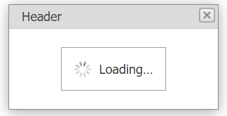

<!-- default badges list -->

[](https://supportcenter.devexpress.com/ticket/details/E1945)
[](https://docs.devexpress.com/GeneralInformation/403183)
<!-- default badges end -->
# Popup Control for ASP.NET Web Forms - How to show the loading panel when loading content

This example demonstrates how use the popup control's client-side functionality to display the loading panel in a pop-up window when content is loading slowly.



## Overview

The main idea is to call the popup control's client-side [GetContentIFrame](https://docs.devexpress.com/AspNet/js-ASPxClientPopupControlBase.GetContentIFrame) method to get the control's IFrame. Then use the loading panel's [ShowInElement](https://docs.devexpress.com/AspNet/js-ASPxClientLoadingPanel.ShowInElement(htmlElement)) method to display the panel within the IFrame. When content is loaded, hide the loading panel.

```aspx
<dx:ASPxLoadingPanel ID="lp" runat="server" ClientInstanceName="lp" />
<dx:ASPxPopupControl ID="popup" runat="server" ... >
    <ClientSideEvents Init="OnPopupInit" Shown="OnPopupShown" />
</dx:ASPxPopupControl>
```

```js
var showPopup = true;
var iframe;
function OnPopupInit (s, e) {
    iframe = popup.GetContentIFrame();
    ASPxClientUtils.AttachEventToElement(iframe, 'load', OnContentLoaded);
}

function OnPopupShown (s, e) {
    if(showPopup)
        lp.ShowInElement(iframe);
}
function OnContentLoaded (e) {
    showPopup = false;
    lp.Hide();
}
```
## Files to Review

* [Default.aspx](./CS/Default.aspx) (VB: [Default.aspx](./VB/Default.aspx))
* [TestPage.aspx.cs](./CS/TestPage.aspx.cs) (VB: [TestPage.aspx.vb](./VB/TestPage.aspx.vb))
